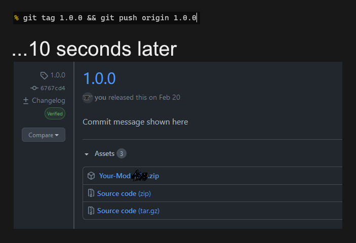

# GitHub Actions

Every time you create and push a new git tag, it'll create a GitHub release for you.
Your mod must be on GitHub.

## Steps

1. Open GitHub.com to your repo.
   1. Navigate to Settings, then Actions - General.
   2. Find "Workflow permissions", and set it to "Read and write permissions".
2. Return to your mod files and set your .zip name:
   1. Open `runner.sh` (`.github/workflows/runner.sh`).
   2. Change the value of `MOD_FOLDER_NAME` on line 5 to the name of your .zip file (not including ".zip", eg "MagicLib").
3. Commit and push some changes, then create and push a new tag.
   1. `git tag 1.0.0 && git push origin 1.0.0`
4. Wait a few moments (check the Actions tab on your GitHub repo) and then you should have a new release.

Optionally, you may edit "blacklist.txt", which contains regex expressions of files that will NOT be included in the released mod folder (eg psd files)

