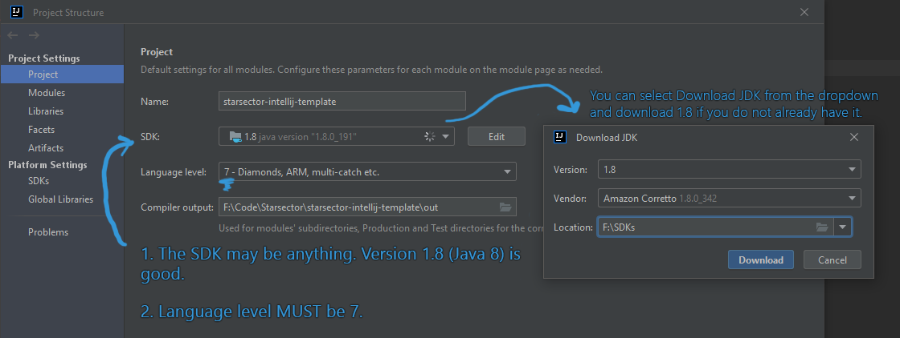
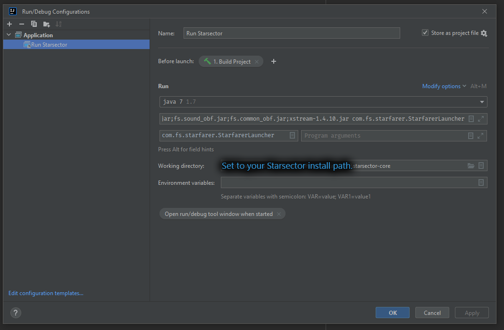
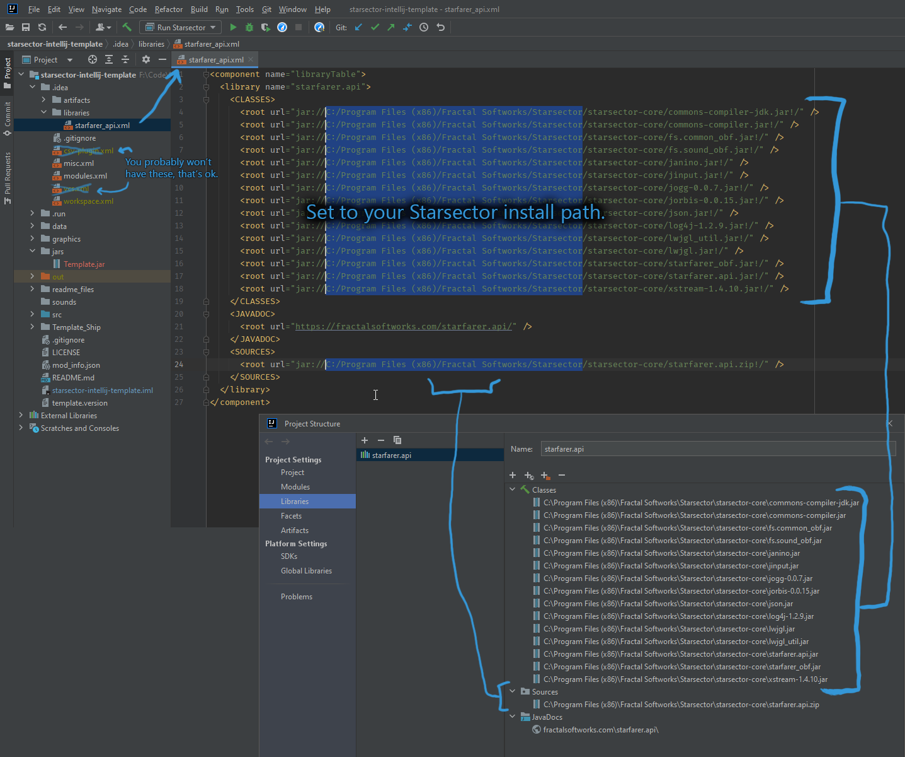
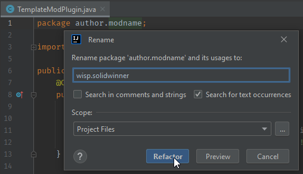
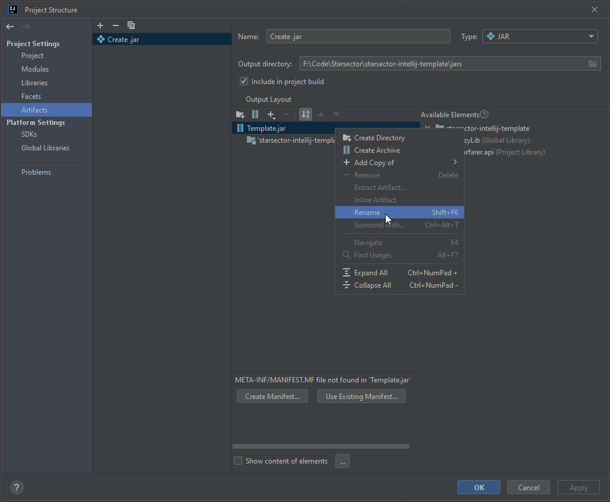

# Starsector IntelliJ Mod Template

v1.0.1

## Description

This is a template for a generic Starsector mod using Java.

When you are done, you will have a mod that does nothing, but is ready for anything to be added.

Written for IntelliJ Community ([free download](https://www.jetbrains.com/idea/download)), but should work with any IDE.
You do NOT need IntelliJ Ultimate. Latest version of IntelliJ is 2022.2 as of writing.

## Optional

- Change `LICENSE` to something else.

## Initial

- Download or `git clone` this repository wherever you want to work.
  - The simplest is to put it right into your mods folder; otherwise, you'll need to either copy it each time you change things or make an alias to it.

## FAQ

- I already have a mod started. Can I just drag and drop this into my mod folder?
    - Yes, but don't overwrite anything you already have.
    - You probably mostly want the `.idea` folder (which contains IntelliJ configuration) and the `src` folder - then,
      move any code you have into the `src` folder and fix the `package` in each .java file (ask if you don't know how).
- Everything is working! Do I still need the `readme_files` folder?
  - lol no, delete it.

## Explanation of Folders/Files

The template contains many folders and files that are commonly used, but not all.
You may not need everything, but leaving them in place doesn't hurt either.

- `.git/` Optional. Used by git to store all git-related information. May be deleted if you are not using git.
- `.idea/` Required. Used by IntelliJ to store settings and configuration.
- `.run/` Optional. Used by IntelliJ, contains a ready-to-use configuration for running the game. May be deleted if you
  want to make your own Run Configuration instead.
- `data/` Optional. Used by Starsector, this folder just contains some common files that mods use that you would
  probably end up creating yourself. May be deleted if you don't need it.
- `graphics/` Optional. Default location to place images of all kinds.
- `sounds/` Optional. Default location to place sounds, including music, which you then add to `data/config/sounds.json`.
- `src/` Optional? Contains example source code which you will presumably build upon. May be deleted if your mod doesn't
  have any code (but then why use this template...?)
- `.gitignore` Optional. Used by git to determine which files should not be committed (for example, not to commit temp
  files used during the build process). May be deleted if not using git.
- `LICENSE` Optional. This is the license file, delete or modify it to your liking.
- `mod_info.json` Required.
- `README.md` Required?
- `yourName_uniqueid.version` Optional. This is a sample Version Checker file. May be deleted if not using Version
  Checker (but you should).


## IntelliJ Configuration

### Set your SDK (the thing that compiles the Java code)

- Open `File -> Project Structure -> Project`.
- Ensure that the `Language Level` is set to `7`.
- Set an SDK. This can be 1.7 (aka 7), 1.8 (aka 8), or higher. You can also download an SDK from this dropdown, if the Download option is provided.
  - Otherwise, [download JDK 7](https://drive.google.com/file/d/1cle4yGhPkROCu3z5WKHKLR098ObGLwPV/view), extract it anywhere, and set it as the SDK.
  - JDK 7: https://drive.google.com/file/d/1cle4yGhPkROCu3z5WKHKLR098ObGLwPV/view
  - Using JDK 8 (1.8) or higher _may_ have slightly faster compile times, but is otherwise the same as using JDK 7 (1.7).



### Ensure that your run configuration is correct:

- In IntelliJ, click `Run - Edit Configurations`.
- Select "Run Starsector"
- [ ] Set Working directory to the location of your `starsector-core` folder, if different than what's currently there.
- [ ] Check other values to make sure they fit your Starsector install. By default, they are set for a typical Windows
  install.
- Click Ok. You should now be able to choose Run Starsector from the Run menu and then click the **Debug** button (the icon
  of a bug)
- If you are running on linux, the VM Arguments should instead be

  ```-server -agentlib:jdwp=transport=dt_socket,server=y,suspend=y,address=5005 -Xverify:none -Djava.library.path=./native/linux -Xms1536m -Xmx1536m -Xss2048k -classpath janino.jar:commons-compiler.jar:commons-compiler-jdk.jar:starfarer.api.jar:starfarer_obf.jar:jogg-0.0.7.jar:jorbis-0.0.15.jar:json.jar:lwjgl.jar:jinput.jar:log4j-1.2.9.jar:lwjgl_util.jar:fs.sound_obf.jar:fs.common_obf.jar:xstream-1.4.10.jar -Dcom.fs.starfarer.settings.paths.saves=./saves -Dcom.fs.starfarer.settings.paths.screenshots=./screenshots -Dcom.fs.starfarer.settings.paths.mods=./mods -Dcom.fs.starfarer.settings.paths.logs=. -Dcom.fs.starfarer.settings.linux=true com.fs.starfarer.StarfarerLauncher```



### "I didn't install the game to the default location"

If your game isn't installed to `C:\Program Files (x86)\Fractal Softworks\Starsector` then we need to fix some more file paths.

If you did install to the default location, skip to the next part.

1. Open `.idea/libraries/starfarer_api.xml`. It should be fairly clear what needs to be fixed; any path that's pointing to the default game installation should be changed to point to wherever you have it installed.
   1. It's also possible to edit this in File -> Project Structure -> Libraries, but for editing en masse, editing the xml directly is simpler.



### Running the game

To actually build your mod and run the game with it, look for and **click the Debug icon**, which looks like a bug and is green by default. It should be at the top of IntelliJ and next to Build (hammer icon) and Run (play icon) buttons.

Clicking the Debug button will build the .jar, launch the game and pause it, attach IntelliJ's debugger, and unpause the game. The game's launcher will then show. Don't forget to enable your mod in the launcher.

Don't click the Run (play) icon; it will cause the game to wait indefinitely for the debugger and never launch.

### It's working, now what?

Now you have a template that works, but we need to personalize it so multiple people can use the template without
stepping on each others' toes, so to speak.

See that in `src`, we have `author.modname` as the package (which matches the folder path `src/author/modname`).

1. [ ] The first step is to change the package of our code. This is an organization thing; if there are two Java files
   with
   the same name in the same package, then only one of them will get loaded, but if they're in different packages, both
   will be loaded.
    1. The easy way to change this is to open up `TemplateModPlugin.java`, click on the first line (`package...`),
       right-click, and choose Refactor -> Rename. Change it to match your username and modname (or whatever you prefer)
       .
    2. When done, you shouldn't have any code in `author.modname`. If that still exists, it can be safely deleted.
    3. 
   
2. [ ] Now, we've changed where the ModPlugin is located and we need to tell the game the new location the game can call
   it
   when the game loads.
    1. Open the `mod_info.json` file, find `"modPlugin"`, and edit it to use your new package (if you forgot, it's the
       first line of your `TemplateModPlugin.java` file).
3. [ ] You can also change the name of the .jar file, which is `Template.jar` by default, in `File -> Project Structure -> Artifacts`, then just right-click on `Template.jar` and choose rename.
   1. [ ] You will also need to update the name of the .jar in your `mod_info.json` file so the game knows where to look.



## Adding more dependencies/libraries

Need to depend on another mod or library (e.g. [GraphicsLib], [LazyLib], [LunaLib], [MagicLib], [Nexelerin], etc)?

1. `File -> Project Structure -> Modules -> "starsector-intellij-template" -> Dependencies tab -> + icon -> JARS or
   Directories`. Select the .jar(s) you want to add.
2. Leave Export unchecked and Scope to Compile.

## Other

Author: Wisp

Lowtech Tempest: Selkie

[GraphicsLib]: https://fractalsoftworks.com/forum/index.php?topic=10982.0
[MagicLib]: https://github.com/MagicLibStarsector/MagicLib/
[LazyLib]: https://github.com/LazyWizard/lazylib/
[LunaLib]: https://github.com/Lukas22041/LunaLib/
[Nexelerin]: https://github.com/Histidine91/Nexerelin/
